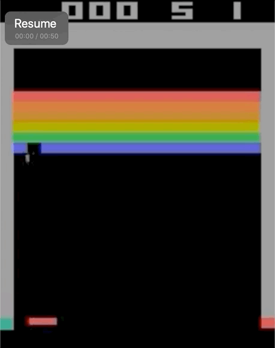
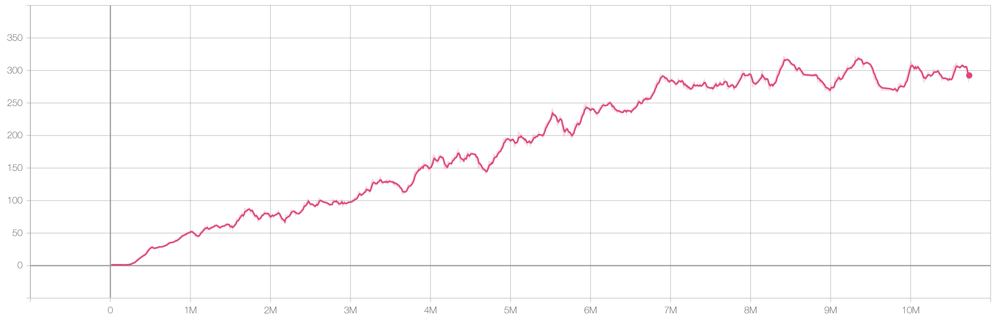

In this project, we implement Rainbow and replace c51 in Rainbow with IQN.

## Algorithm Implemented

- [x] Rainbow
- [x] PER
- [x] Noisy Nets
- [x] Double
- [x] c51
- [x] Dueling nets
- [x] IQN

## Results

Basically all arguments are from reference papers, I did not take much time to fine-tune these arguments, since it takes too long to run a trial on atari.

### Rainbow-IQN on BreakoutNoFrameskip-v4

**Video**



**Learning Curve**

<figure>
  
  <figcaption>Episodic rewards averaged over 100 episodes at training time</figcaption>
</figure>

## Requirements

It is recommended to install Tensorflow from source following [this instruction](https://www.tensorflow.org/install/source) to gain some CPU boost and other potential benefits.

```shell
# Minimal requirements to run the algorithms. Tested on Ubuntu 18.04.2, using Tensorflow 1.13.1.
# Forget the deprecated warnings... This project is not designed according to Tensorflow 2.X
conda create -n gym python
conda activate gym
pip install -r requirements.txt
# install gym atari
pip install 'gym[atari]'
# Install tensorflow-gpu or install it from scratch as the above instruction suggests
pip install tensorflow-gpu
```

## Running

```shell
# Silence tensorflow debug message
export TF_CPP_MIN_LOG_LEVEL=3

# When running distributed algorithms, restrict numpy to one core
# Use numpy.__config__.show() to ensure your numpy is using OpenBlas
# For MKL and detailed reasoning, refer to [this instruction](https://ray.readthedocs.io/en/latest/example-rl-pong.html?highlight=openblas#the-distributed-version)
export OPENBLAS_NUM_THREADS=1

# By default, this line runs rainbow-iqn, which replaces c51 in rainbow with iqn
# For full argument specification, please refer to run/train.py
python run/train.py
```

## Details

All tests are done in PongNoFrameskip-v4 and BreakoutNoFrameskip-v4, 

1. Double Q nets, noisy layers, PER, multi-steps are used by default. 

2. Best arguments are kept in `args.yaml`; most arguments come from the rainbow.

3. Unlike the official implementation, we apply layer normalization to dense layers, instance normalization to conv layers. Tehse could be designated by `conv_norm` and `dense_norm` in `algo/rainbow_iqn/args.yaml`

## Paper References

Dan Horgan et al. Distributed Prioritized Experience Replay 

Hado van Hasselt et al. Deep Reinforcement Learning with Double Q-Learning

Tom Schaul et al. Prioritized Experience Replay

Meire Fortunato et al. Noisy Networks For Exploration

Ziyu Wang et la. Dueling Network Architectures for Deep Reinforcement Learning

Will Dabney et al. Implicit Quantile Networks for Distributional Reinforcement Learning

## Code References

[Homework of Berkeley CS291-112](http://rail.eecs.berkeley.edu/deeprlcourse/)

[Google Dopamine](https://github.com/google/dopamine)